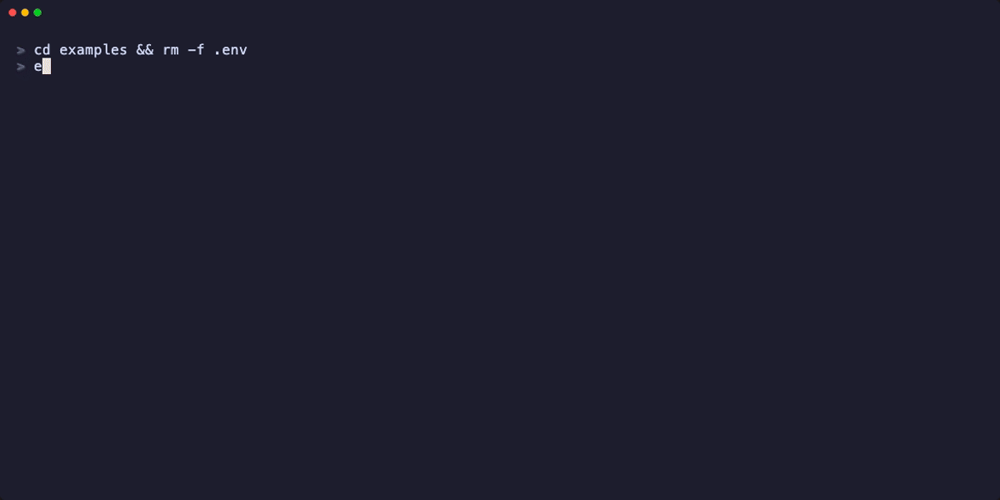
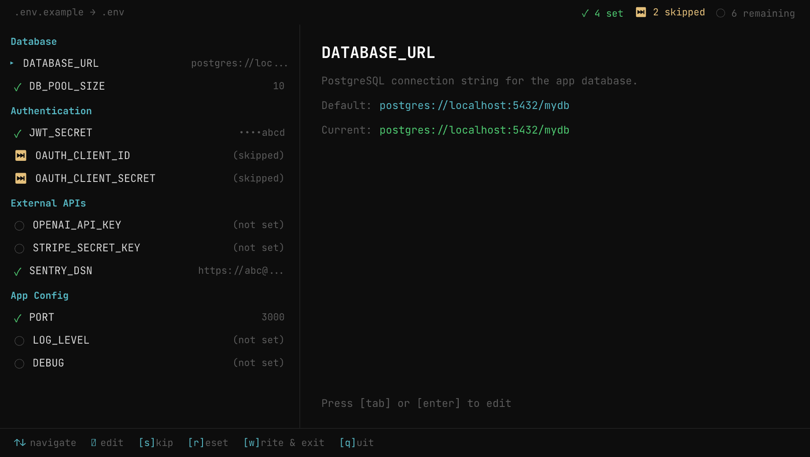
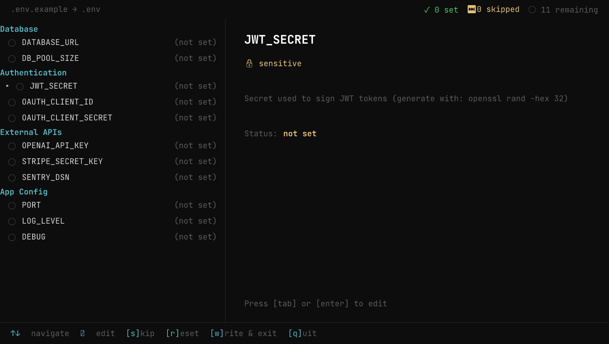

# env-pilot

Interactive TUI for setting up `.env` files from a template. No more copying `.env.example` and filling in values by hand in a text editor.



<details>
<summary>Screenshots</summary>





</details>

## Install

```bash
cd env-pilot && go build -o env-pilot .
```

Move the binary somewhere on your `$PATH` to use it anywhere:

```bash
mv env-pilot /usr/local/bin/
```

## Quick start

```bash
cd your-project
env-pilot
```

That's it. env-pilot auto-detects your template file, opens a master-detail TUI, and writes to `.env`.

## How it works

1. **Parses** your `.env.example` (or similar template) — extracts keys, default values, descriptions from comments, and section groupings
2. **Shows a master-detail TUI** — all keys listed on the left with status indicators, detail panel on the right for the selected key
3. **Auto-saves** — every change is written to `.env` immediately, so you never lose work
4. **Resumes** — run it again and it picks up where you left off. Already-set keys keep their values.

## Keyboard shortcuts

| Key | Action |
|-----|--------|
| `↑` `↓` | Navigate the key list |
| `Tab` or `Enter` | Edit the selected key |
| `Enter` (in input) | Submit value (or accept default if empty) |
| `Esc` | Cancel editing, return to navigation |
| `s` | Skip the current key |
| `r` | Reset key (clear value and skip status) |
| `w` | Write & exit |
| `q` | Quit |
| `Ctrl+C` | Quit immediately |

When editing a **sensitive key** (passwords, API keys, tokens), input is masked. After submitting, a confirmation screen shows the last 7 characters for verification — press `r` to reveal the full value, `Enter` to accept, or `x` to redo.

## CLI flags

```bash
env-pilot                        # Auto-detect template, interactive TUI
env-pilot --from .env.template   # Use a specific template file
env-pilot --out .env.local       # Write to a different output file
env-pilot --status               # Print counts and exit (non-interactive)
env-pilot --review               # Print all keys with status and exit
```

| Flag | Description |
|------|-------------|
| `--from <file>` | Path to template file. Default: auto-detect (see below). |
| `--out <file>` | Path to output file. Default: `.env`. |
| `--status` | Print `N total, N set, N skipped, N remaining` and exit. |
| `--review` | Print all keys with their current status and exit. |

## Template file format

env-pilot reads standard `.env` template files — the same `KEY=VALUE` format used by [dotenv](https://github.com/motdotla/dotenv), [Laravel](https://laravel.com/docs/configuration), [Docker Compose](https://docs.docker.com/compose/environment-variables/), and virtually every framework.

### Auto-detection

When run without `--from`, env-pilot looks for these files in order:

1. `.env.example`
2. `.env.sample`
3. `.env.template`
4. `.env.dist`
5. `.env.defaults`

### Keys and values

```bash
# Standard key-value pair
DATABASE_URL=postgres://localhost:5432/mydb

# Empty value (env-pilot will prompt for it)
API_KEY=

# Placeholder values are detected and NOT treated as defaults
OAUTH_CLIENT_ID=your-client-id-here

# Quoted values are supported
PASSWORD='my$pecial&value'
```

- Keys with a non-empty, non-placeholder value are shown as **defaults** — press Enter to accept them
- Keys with placeholder values (`your-*`, `change-me`, `TODO`, `xxx`, etc.) are prompted normally, not offered as defaults
- Keys matching sensitive patterns (`*_KEY`, `*_SECRET`, `*_TOKEN`, `*_PASSWORD`, `*CREDENTIAL*`, `*_PRIVATE`) get **masked input**

### Comments as descriptions

Comments directly above a key become that key's **description** in the detail panel:

```bash
# PostgreSQL connection string for the app database
DATABASE_URL=postgres://localhost:5432/mydb
```

This shows "PostgreSQL connection string for the app database" as context when editing `DATABASE_URL`.

### Sections

There is no formal standard for sections in `.env` files. env-pilot detects sections using the conventions most commonly found in real-world projects:

**Pattern 1: Comment + blank line** (most common — used by Laravel, Mastodon, Supabase, etc.)

```bash
# Database
DB_HOST=localhost
DB_PORT=5432

# Redis
REDIS_URL=redis://localhost:6379
```

A comment line followed by a blank line is treated as a section header. Keys below it (until the next section) are grouped under that section.

**Pattern 2: Short label + description** (common for documented templates)

```bash
# Database
# PostgreSQL connection string
DATABASE_URL=postgres://localhost:5432/mydb
```

When a short comment (≤30 chars, no punctuation like `.` `:` `/`) is followed by a longer description comment directly above a key, the short comment becomes the section header and the rest becomes the key's description.

**Pattern 3: Decorative borders** (used by Cal.com, DoraCMS, and others)

```bash
# ── Database ──────────────────────────
DATABASE_URL=postgres://localhost:5432/mydb

# === Authentication ===
JWT_SECRET=

# ------- Redis -------
REDIS_URL=redis://localhost:6379

#########################
# External APIs
#########################
OPENAI_API_KEY=
```

Lines containing `──`, `===`, `---`, or `###` are recognized as section headers. Decorative characters are stripped to extract the section name.

**No sections? No problem.** If your template has no section markers, all keys are shown in a flat list. Sections are optional.

### Skip markers

When you skip a key, env-pilot writes a `# env-pilot:skipped` comment above it in the output `.env`:

```bash
# env-pilot:skipped
OAUTH_CLIENT_ID=
```

This marker is recognized on subsequent runs so env-pilot knows you intentionally skipped it (vs. simply haven't gotten to it yet). Use `r` to reset a key and clear its skip status.

Navigate with arrow keys, press Tab to edit, Enter to accept defaults or submit values. Changes are saved to `.env` automatically.
